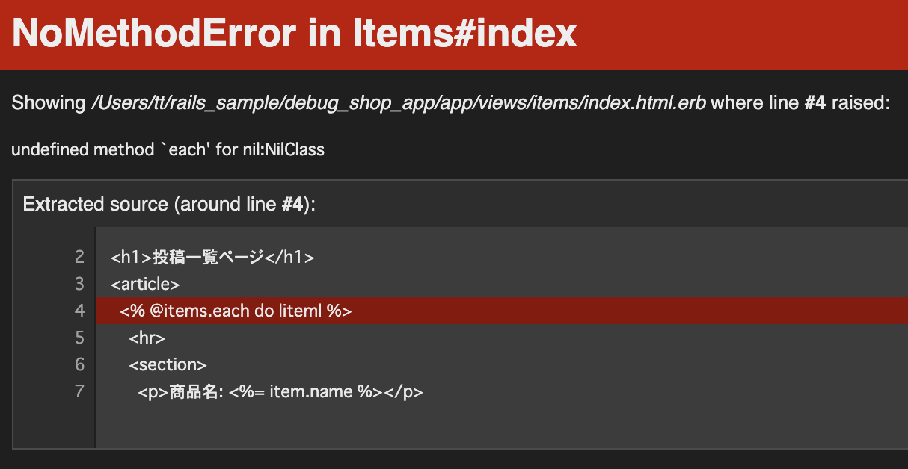

# エラー解消のヒント

## バグ その1



- 検索する前に，エラー文をしっかり読み，原因を予測しましょう。
  - 単語の意味が分からない場合は，1つ1つしっかり調べていきましょう
  - ポイントは 次の3箇所です

```
NoMethodError
undefined method `each' for nil:NilClass
<% @items.each do |item| %>
```

- エラー画面に「ビューファイル」が表示されていますが，「ビューファイル」が原因とは限りません
- 処理の流れが「ルーティング」-->「コントローラ」-->「ビュー」であることから，真の原因を推測しましょう

## バグ その2, その3


- `create` アクションでエラーが出ていますので， `binding.pry` は `create` メソッドの最初に配置しましょう

```rb
  def create
    # 最初に追加
    binding.pry
    @item = Item.create!(item_params)
    redirect_to items_path
  end
```

- 新規投稿して処理を止め，以下を確認してみましょう。

```rb
item_params
params.require(:items).permit(:name, :price)
params.require(:items)
params
params.keys
params[:items]
```

エラーに表示されたコードの中に原因があるとは限りません。処理の流れは，以下の順序です。

- 「リクエスト前(new)のルーティング」
- 「リクエスト前(new)のコントローラ」
- 「リクエスト前(new)のビュー」
- 「リクエスト後(create)のルーティング」
- 「リクエスト後(create)のコントローラ（ここでエラー！）」

## 何を変更したか忘れてしまった……

次のコマンドで差分を確認しましょう！

```
git diff
```
